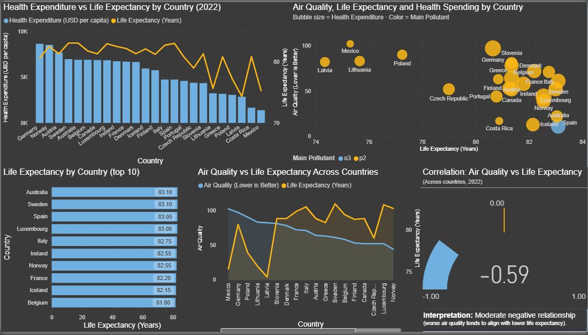

# Health & Air Quality Data Pipeline
A Data Engineering project that builds a scalable data pipeline to collect, transform, and store global health-related data. It demonstrates key data engineering concepts like API integration, web scraping, ETL workflows, data validation, orchestration with Airflow, and database loading. 

## Project Overview 
This project integrates three health data sources into a single SQLite database for analysis and reporting: 
- Life Expectancy: Fetched from OECD API (XML) 
- Air Quality: Collected from the IQAir API (JSON) 
- Health Expenditure: Scraped from Wikipedia (HTML) 

The pipeline is orchestrated with Apache Airflow using Docker, and the data is loaded into SQLite. The final dataset merges life expectancy, air quality index, and health spending per country.

### Tools & Technologies 
- __Python 3.11__
- __Apache Airflow 2.8.0__ (Dockerized)
- __SQLite__ (via sqlite3)
- __Docker & Docker Compose__
- __APIs: OECD API (XML), IQAir API (JSON)__ 
- __Web Scraping:__ pandas.read_html for Wikipedia
- __Pytest__ (for testing)
- __Pandas__ (ETL and transformation)
- __JSON, CSV, SQL__ (data formats)

### Data Sources & APIs 

[Project Overview](# Source Type Description )
OECD API XML Life expectancy by country (2020+) \
IQAir API (AirVisual)JSON (REST)Air quality index per city \
WikipediaWeb page
Health expenditure per capita  

### Architecture Overview 

|   __Airflow DAGs__    |
|-----------------------|
|
 _(health & validation)_ 
|
|
 &#x1F807; 
|       
|
 __Data Ingestion__ 
|
|
 _OECD API (XML)_ 
|
|
 _IQAir API (JSON)_ 
|
|
 _Wikipedia (HTML)_  
|
|
 &#x1F807; 
|
|
 __Data Transformation__ 
|
|
 _Cleaning_ 
|
|
 _Aggregation_ 
|
|
 _Merging datasets_ 
|
|
 &#x1F807; 
  |
|
 __Data Storage (SQLite)__ 
|
|
 _Raw tables_ 
|
|
 _Cleaned dataset_ 
|

### How to Run the Project 

#### Prerequisites 
- Install Docker and Docker Compose 
- Get an IQAir API Key and set it in a .env file: 
<pre> IQAIR_API_KEY=your_api_key_here </pre>

#### Step-by-Step Guide
1. Clone the repo
<pre> git clone https://github.com/evmten/biohealth-etl-pipeline.git </pre>
<pre> cd biohealth-etl-pipeline </pre>

2. Start Airflow containers
<pre> docker-compose up --build </pre>

3. Trigger the pipeline DAG 
* Go to http://localhost:8080 (Airflow UI)
* Trigger health_data_pipeline → This will:
- Fetch data from APIs
- Save raw data
- Transform and merge datasets
- Store results in SQLite 

4. Validate Data 
- The pipeline triggers validate_health_data DAG automatically for validation checks.

5. Run SQLite queries (*optional) 
- Use a SQLite viewer or run:
<pre> python src/load_to_sqlite.py </pre>

6. Run Tests
<pre> pytest tests/test_transform.py </pre>

### Testing Instructions
Run the tests after the DAG completes:
<pre> pytest tests/test_transform.py </pre>

Tests include: 
- Data transformation logic (life expectancy, air quality, health spending) 
- Database connection and data integrity (SQLite)

### Dashboard Overview

The dashboard explores the relationship between air quality, life expectancy, and health expenditure across countries (2022).

Key elements:
- Health expenditure and life expectancy are compared across countries to provide spending context.
- A scatter plot shows how life expectancy relates to air quality, with bubble size representing health expenditure and color indicating the main pollutant.
- Countries are ranked by life expectancy to highlight top performers.
- A correlation metric summarizes the overall relationship between air quality and life expectancy across countries.

#### Key Insights

- Countries with poorer air quality tend to have lower life expectancy, even when health expenditure is relatively high.
- Higher health spending alone does not guarantee better outcomes if air quality is poor.
- The correlation between air quality and life expectancy is moderately negative (–0.59), suggesting a meaningful but not exclusive relationship.
